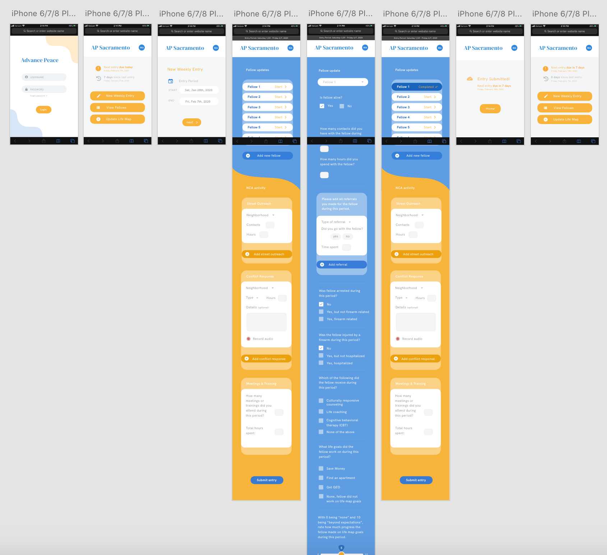

# Week 04 Media Queries

### 1. Design the way you want your website to look (Sketch / Illustrator / Hand Drawing ... )

### 2. Create the structure (HTML / CSS ) for your final project.  Make sure that it’s responsive! 

See assets folder