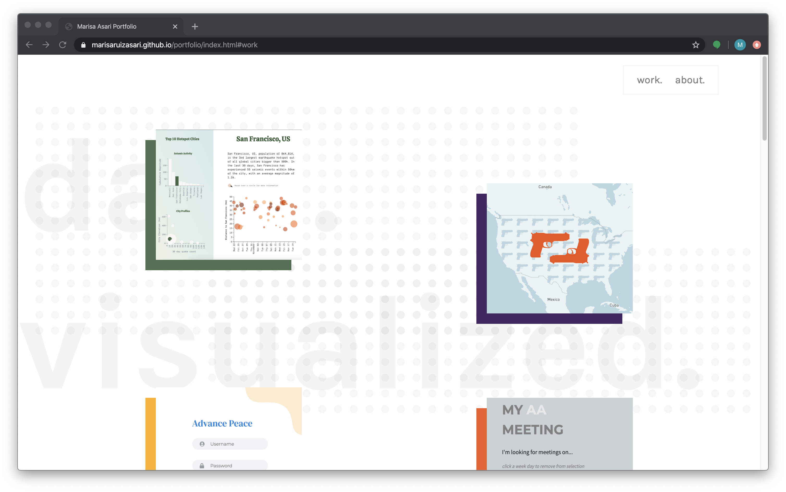
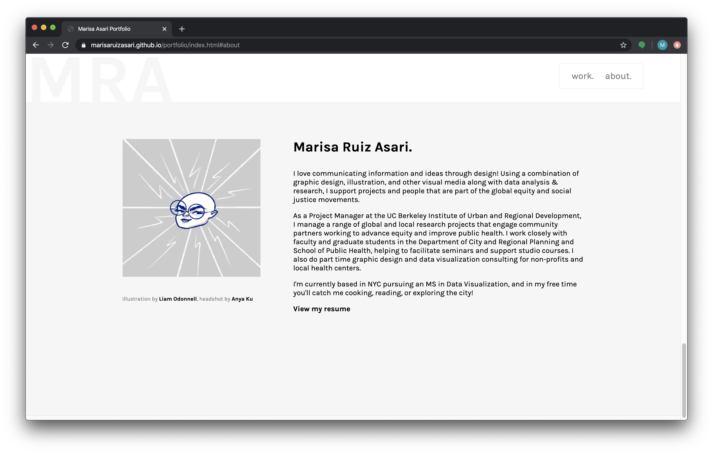
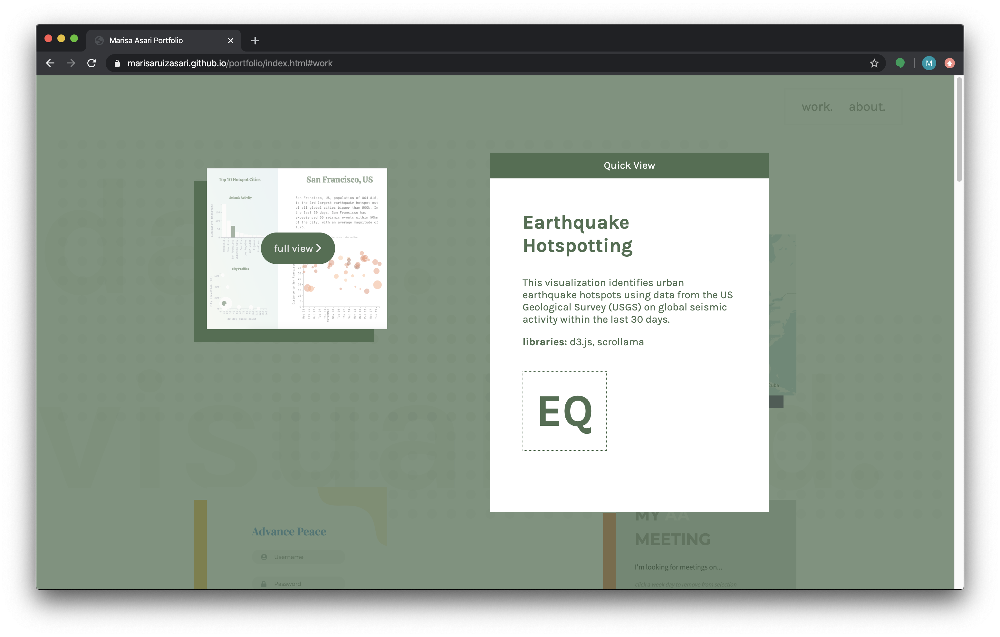
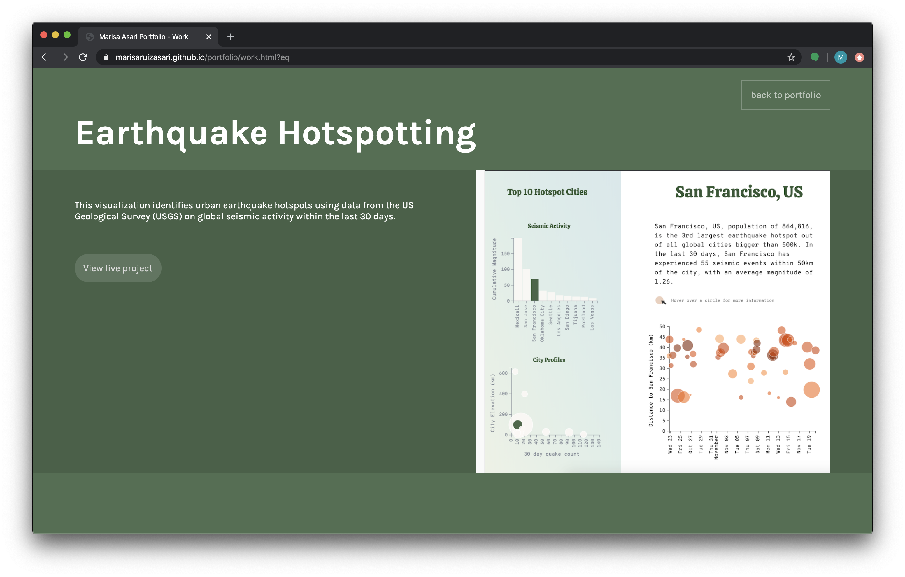
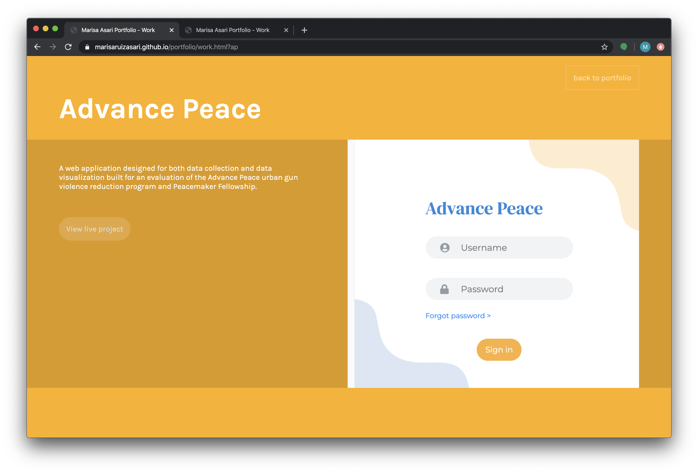
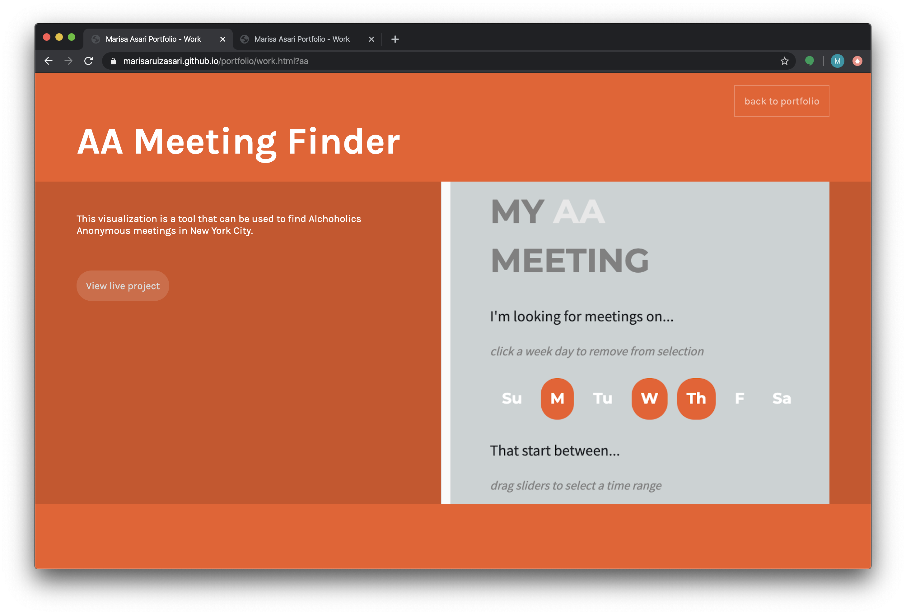
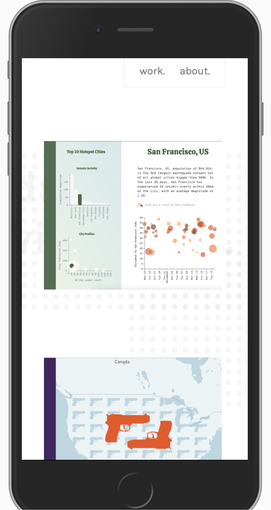
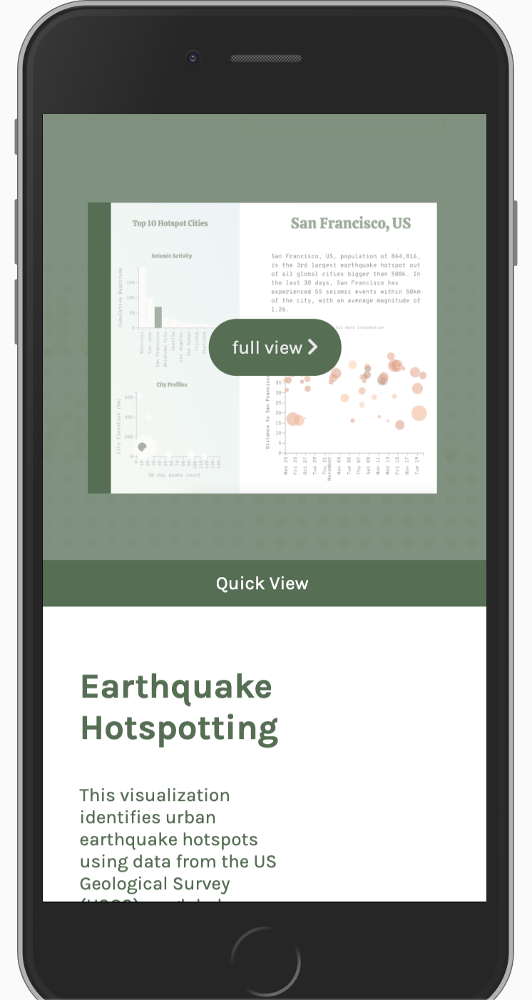
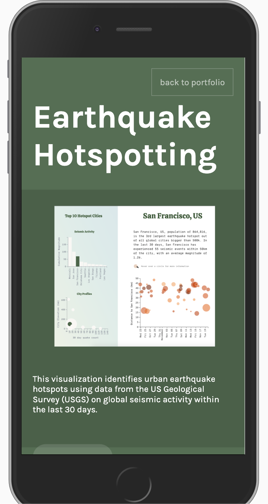
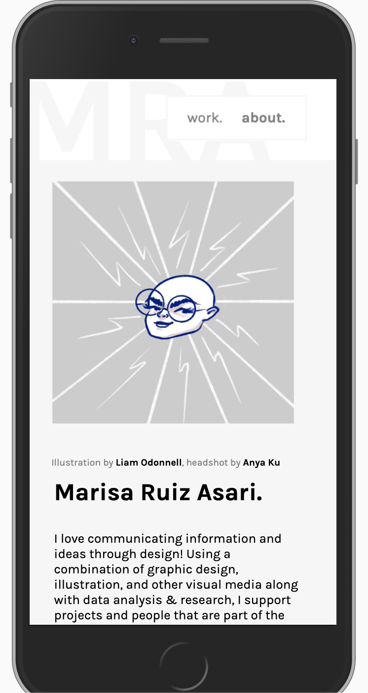

# Web Advanced Midterm Project
[View on Github Pages](https://marisaruizasari.github.io/portfolio/index.html)

### Concept

For the midterm project, I chose to work on a dynamic portfolio that will showcase work completed as part of the Masters in Data Visualization program at Parsons School of Design. The idea is to create a virtual space to hold all of my work, and to be able to build on this site in the future as I complete additonal projects. 

### Explain your project

The portfolio reads projects from a JSON file, and uses handlebars to populate template sections on the home page.

JSON project data preview: 
``` json
 "projects": [
        {   
            "id": "eq",
            "title": "Earthquake Hotspotting",
            "images": {
                "thumbnail": "eq.png",
                "content-images": []
            },
            "color": "#4F6F51",
            "description": "This visualization identifies urban earthquake hotspots using data from the US Geological Survey (USGS) on global seismic activity within the last 30 days.",
            "libraries": ["d3.js, scrollama"],
            "project-link": "work.html?eq",
            "github-link": "https://marisaruizasari.github.io/earthquake-hotspotting/"
        },
        {
            "id": "gv",
            "title": "Urban Gun Violence",
            "images": {
                "thumbnail": "gv.png",
                "content-images": []
            },
            "color": "#442560",
            "description": "An exploration of urban gun violence in the US. With alarming gun homicide and assault rates in the us, what can be done to support communities most impacted by gun violence?",
            "libraries": ["vue.js, greensock, d3.js"],
            "project-link": "work.html?gv",
            "github-link": ""
        },
```

Handlebars template: 
```javascript
<script id="project-template" type="x-handlebars-template">
                <div class="flexrow">
                    {{#each projects}}
                        <div class="flexrow-component justify-bottom">
                            <div id="{{id}}" class="project-container">
                                <div class="color-block" style="background: {{color}}"></div>
                                <div class="img-contain">
                                    
                                    <a href="{{project-link}}">full view <i class="fas fa-chevron-right"></i></a>
                                </div>
                            </div>
                        </div>
                    {{/each}}
                </div>

            </script>
```

Load in data from JSON, then compile handlebars template and add all interactivity based on project properties:
```javascript
function loadData() {
	$.getJSON("content.json", (projects)=> {

        console.log(projects);

        // call the handlebars function from below
		handle(projects);

	});
}

// add projects to page using handlebars 
function handle(projects) {

    let source = $("#project-template").html();
    let projectTemplate = Handlebars.compile(source);
    let result = projectTemplate(projects);
    let container = $('#projects-container');
    container.append(result);

    // call the function to add all interactivity
    addInteractivity(projects);
}

```

#### Portfolio home

The portolio home includes two sections, work and about



In the work section, users can hover on a project for a "quickview", or click "full view" to go to the project page.



#### Project pages

When a user navigates to a project page, the page is filled out dynamically from the content JSON file. Each project has its own color, descriptive text, and set of images which can be easily updated through the JSON file. Here I plan to add additional information as I get closer to completing the MSDV program.





#### Responsiveness & Mobile view

The site is responsive and mobile friendly. Projects wrap and center on mobile view, so that projects stack in one column. The quickview is moved to the bottom half of the screen instead of to the right or left of the project on click. The about section also wraps and centers its content.



### Challenges

I had a bit of a hard time getting the positioning right on the quickview. I'm currently calculating the position of the hovered object, and if the y position is on the left half of the screen the quickview gets displayed on the right (and vice versa). This works for the most part, but ocasionally the x position is too high. I also made this responsive by using a media query that displays the quickview on the bottom half of the screen if viewport width is too small to have more than one project in one "row". This also works for the most part, but I will need to adjust the formatting on the quickview a bit more so that none of the text gets cut off.

Calculate quickview position: 
```javascript
// make the quickview box visible
        $('#quickview').css({'visibility':'visible'})
        $('#qv-label').css({'background':`${colorBlock}`})
        $('#qv-content').css({'color':`${colorBlock}`, 'display':'', 'flex-direction': ''})
        $('#qv-content-text').css({'flex-basis':'', 'padding-right':''})
        
        // get the x and y position of the hovered element
        let el = this.getBoundingClientRect()
        console.log(el)

        // if window width is greater than 1140 px set the position of the quickview box right or left
        if (window.innerWidth > 1140) {
            // if the x position is less than half of the viewport width, display the quickview on the right hand side, otherwise display it on the left
            if (el.x < window.innerWidth/2) {
                $('#quickview').css({'right':'20vw', 'top': '15vh', 'width': '30vw', 'height': '70vh','left': ''})
            } else {
                $('#quickview').css({'left':'20vw', 'width': '30vw', 'height': '70vh', 'right': ''})
            }
        } else {

            if (el.y < window.innerHeight/2) {
                $('#quickview').css({'right':'', 'left':'0', 'bottom':'0px', 'width':'100%', 'height':'40vh', 'top': ''})
                $('#qv-content').css({'display':'flex', 'flex-direction': 'row'})
                $('#qv-content-text').css({'flex-basis':'60%', 'padding-right':'20px'})
                $('#qv-logo').css({'flex-basis':'20%'})
            } else {
                $('#quickview').css({'visibility':'hidden'})
            }
        }
```

### Next Steps

My next steps are to add to the projects JSON file with additional images and documentation including more descriptive text and explanation of my design and implementation process for each project. 

I also want to continue to build on the responsiveness and media queries - especially for the hover quickview and the individual project pages. I may also create additional handlebars templates for the project pages.